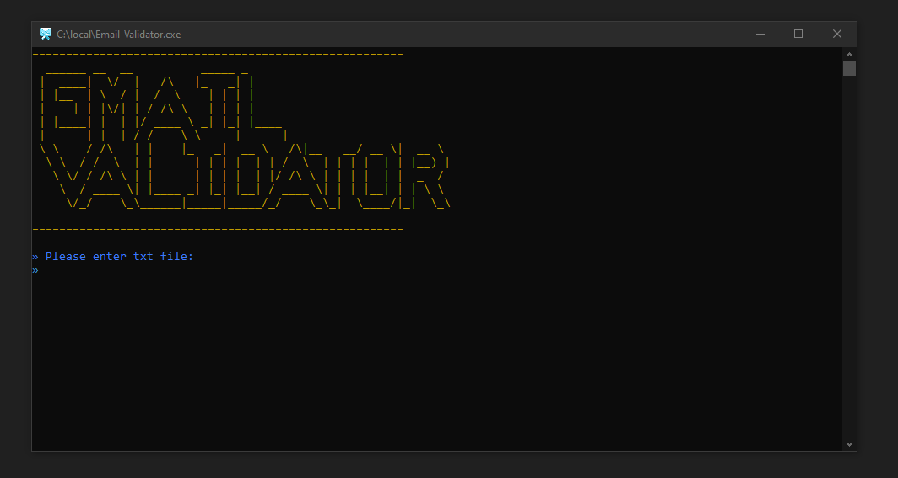

# ✉️ Email Validator

A 🔒 powerful and user-friendly email validation tool that can process big lists of emails with ease.

---

## 🚀 Features

✅ **Strict Validation** – Only allows properly formatted emails  
🌐 **Domain Verification** – Checks if domains actually exist  
📤 **Bounce Verification** – Detects hard-bounced email addresses  
🔍 **Email Verification** – Verifies if the email really exists  
📂 **Bulk Processing** – Validates entire email lists at once   
💾 **Results Export** – Saves valid emails to `valid.txt`

---

## ⚙️ Installation

1. ⬇️ Download the latest release: `Email-Validator.exe`  
2. 📁 Place the executable in your preferred directory

🛠️ **No dependencies needed** – It's a 100% standalone app!

---

## 🧪 Usage

1. ▶️ Run `Email-Validator.exe`  
2. 📄 Enter the path to your email list file when prompted  
3. 👀 Watch real-time validation results  
4. ✅ Find valid emails in the generated `valid.txt`

---

🧊 Pro Tip: Use clean `.txt` files with one email per line for best results.
